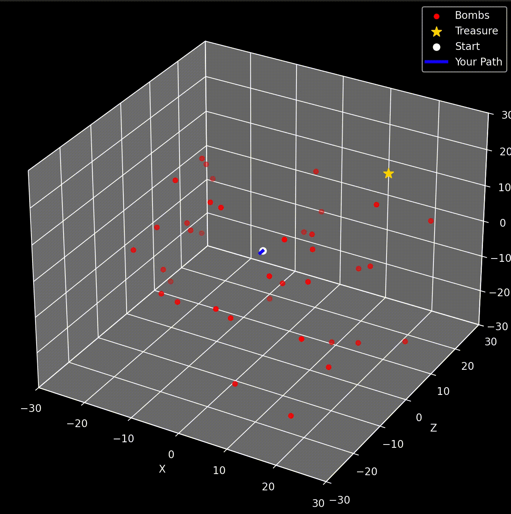

# Terminal Treasure Hunter

[](https://github.com/coopermay/terminal-treasure-hunter/actions/workflows/ci.yml)

<p align="center">
  
</p>

A 3D treasure hunt played in the terminal, written in C++17. Navigate a 3D grid using only a "hot/cold" thermometer, avoid hidden bombs, and find the treasure in as few moves as possible. When the game ends, a Python/matplotlib script replays your path as an animated 3D plot showing every bomb you avoided (or hit).

## Features

- **3D grid movement** across a 59×59×59 world (coordinates -29 to 29 on each axis)
- **Proximity thermometer:** 11 levels of feedback, from "absolutely freezing" to "SCORCHING", based on your straight-line distance to the treasure
- **Procedurally generated hazards:** 10–40 bombs per game, each with a 3×3×3 kill zone. Bombs are always placed away from the start and the treasure, so every game is winnable.
- **Efficiency score:** compares your move count to the shortest possible path
- **3D replay:** an animated matplotlib visualization of your path, the bombs, and the treasure

## Getting started

Requirements: a C++17 compiler (clang++ or g++), `make`, and Python 3.

```bash
git clone https://github.com/coopermay/terminal-treasure-hunter.git
cd terminal-treasure-hunter
pip3 install -r requirements.txt
make run
```

Run the game from the repository folder so it can find `visual.py` for the replay.

Each game prints its map seed. To play the same map again, pass that seed:

```bash
./px --seed 12345
```

## Controls

| Key | Action |
| --- | --- |
| `W` / `S` | Move +x / -x |
| `D` / `A` | Move +z / -z |
| `-` / `C` | Move up (+y) / down (-y) |
| `X` | Quit |

Press Enter after each move, or type several moves at once (for example `wwwdd`) and press Enter to run them in order.

## How it works

- **World generation (`src/world.cpp`):** A `std::mt19937` generator, seeded from the command line or `std::random_device`, places the treasure at least 10 moves from the start. Bombs are then placed so that none of them is within 3 cells of the start or the treasure, so every map is winnable.
- **Game loop (`src/game.cpp`):** `Game::handleKey` applies one key press and returns the outcome (still playing, won, exploded, or quit) without doing any input or output, so the rules can be tested on their own. `Game::run` handles the terminal side: after each move it checks whether you're in any bomb's kill zone (Chebyshev distance ≤ 1) and reports your distance to the treasure as a thermometer reading. Efficiency is `shortest path / your moves`, where the shortest path is the Manhattan distance from the start to the treasure.
- **Replay (`visual.py`):** At the end of every game, the C++ program writes the bomb positions, the treasure position, and your full path to text files, then launches the Python script. The script animates your path in 3D, drawing the game's y axis vertically.

## Testing

The game logic is covered by unit tests written with [Catch2](https://github.com/catchorg/Catch2), which is included in the repository, so there's nothing to install:

```bash
make test
```

The tests cover the distance math, wall and kill-zone boundaries, every movement key, the thermometer cutoffs, and full games played from scripted input. They also generate 500 seeded worlds and check that each one follows the placement rules, and that the same seed always produces the same map.

GitHub Actions builds the project and runs the tests on Linux and macOS for every push, with compiler warnings treated as errors.

## Project structure

```
include/
  vec3.h          Vec3 point type and distance functions
  config.h        world size, bomb counts, and other tuning constants
  world.h         World: treasure and bomb placement
  player.h        Player: position, path, and bounded movement
  game.h          Game: key handling and the terminal game loop
  replay.h        saving replay data and launching the visualizer
src/              implementations, plus main.cpp (argument parsing and startup)
tests/            Catch2 unit tests, one file per module
third_party/      vendored Catch2 v3.7.1
visual.py         3D replay of the last game (matplotlib)
Makefile          build, run, and test targets
requirements.txt  Python dependencies
```
